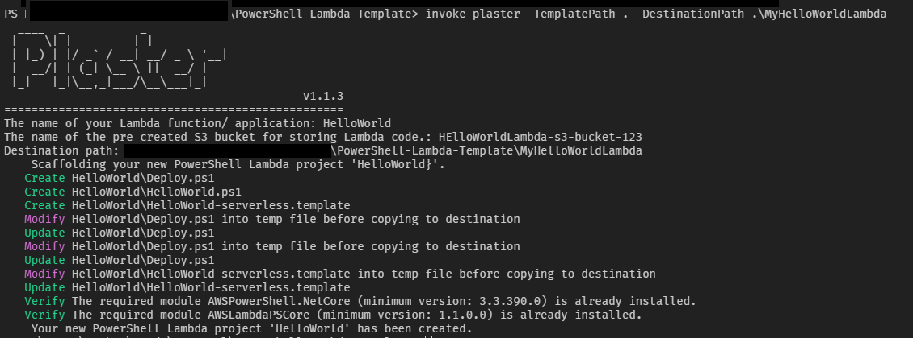

# PowerShell-Lambda-Template

## Synopsis

This template can provide a PowerShell developer with a faster feedback loop when developing a PowerShell Lambda function.

## Description

Quickly iterate development of PowerShell Lambda functions using this template workflow.

This workflow uses AWS Serverless Application Module (SAM) template to describe the Lambda function as an application. The template can then be transformed, deployed, updated, and torn down quickly via command line, enabling the developer to observe and receive feedback quickly.

## File Content

* `Deploy.ps1`: The `Deploy.ps1` script will deploy the PowerShell Lambda application using the AWS SAM model.
* `serverless.template`: The `serverless.template` is the SAM (CloudFormation) template that describes the AWS Lambda.
* `PowerShellLambda.ps1`: The `PowerShellLambda.ps1`, which will be renamed by Plaster as the Lambda name, is the PowerShell Lambda code.
* `plasterManifest.xml`: The `plasterManifest.xml` contains the Plaster construct that transforms the template into actual project folder structures.

## Prerequisites

* [.Net Core SDK](https://dotnet.microsoft.com/download)
* [AWS CLI](https://docs.aws.amazon.com/cli/latest/userguide/install-windows.html)
* [PowerShell Core 6](https://github.com/PowerShell/PowerShell)
* PowerShell modules:
  * [Plaster](https://github.com/PowerShell/Plaster)- Plaster is a template-based file and project generator similar to [Yeoman](https://yeoman.io/)
  * [AWSPowerShell.NetCore](https://www.powershellgallery.com/packages/AWSPowerShell.NetCore)
  * [AWSLambdaPSCore](https://www.powershellgallery.com/packages/AWSLambdaPSCore)

## Assumptions

Assuming you already have:

* Pre-created S3 bucket in the target AWS account.
* Already configured the AWSPowerShell.NetCore and AWS CLI credentials/ profiles/ default regions.
  * AWS PowerShell - [Using AWS Credentials](https://docs.aws.amazon.com/powershell/latest/userguide/specifying-your-aws-credentials.html)
  * AWS CLI - [Configuring the AWS CLI](https://docs.aws.amazon.com/cli/latest/userguide/cli-chap-configure.html)

## Usage

Once you have the prerequisites ready, use the following steps to create a new PowerShell SAM Lambda project using the template.

***NOTE: make sure you have the AWS credential configured for both AWS PowerShell and AWS CLI.***

### High Level Steps

1. Open the `PowerShell Core 6` console.
2. Type the following command and press enter:
    ``` powershell
    Invoke-Plaster -TemplatePath 'C:\Code\PowerShell-Lambda-Template' -DestinationPath C:\Code\MyHelloWorldLambda
    ```
3. You will be prompted for a Lambda name, S3 bucket name. Please provide answers.

    *(Hint: Press `Ctrl-C` to stop)*
4. You should see output similar to the following:

    
5. Navigate to the `C:\Code` folder. It will contain the following folder and file structure. The descriptions are in the brackets.
    ```
    C:\Code
    \---MyHelloWorldLambda (from the -Destination of Invoke-Plaster)
        \---HelloWorld (The lambda name)
                Deploy.ps1 (The PowerShell Script for code deployemnt)
                HelloWorld-serverless.template (SAM template)
                HelloWorld.ps1 (The actual PowerShell Lambda code)
    ```
6. Open the `HelloWorld` folder in Visual Studio Code.
7. The `HelloWorld.ps1` contains the basic PowerShell Code to output environmental variables.
8. Open the `Deploy.ps1` file
9. Make sure you have `PowerShell 6.x` selected on the bottom right. This ensures we are using PowerShell Core 6 in the VSCode's Integrated Console.
10. Press `Ctrl + F5` to deploy the default Lambda to the AWS account (using default region).

    ***NOTE: make sure you have the AWS credential configured for both AWS PowerShell and AWS CLI.***
11. Now, you can iterate quickly with:
    1. update the `HelloWorld.ps1` with the code you want.
    2. Go to `Deploy.ps1`
    3. Press `Ctrl + F5` to update the Lambda, test, observe and repeat.

## Notes

**If in VSCode, run the Deploy.ps1 file using Ctrl+F5. F8 or select and run won't work.**